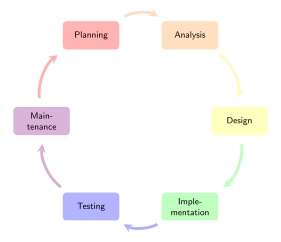

# Application Development Lifecycle

**Risk assessment** has to be performed in each stage of the application development lifecycle. 

If the user's privacy would be impacted in an unacceptable or illegal manner development needs go back to previous stages and re-assess the problem in order to avoid fruitlessly spending resources.

---

**TODO**

- [ ] Add overview
- [ ] add the fact that specific points need to be changed during the development lifecycle regarding to the processed data and local regulations
- [ ] add information about changes in the process through the usage of the AppPETs Library